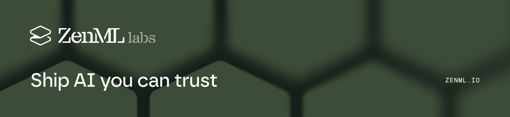

  

# 🥼 ZenML Labs

### 🚀 Open-source infrastructure for production AI

We build tools to **ship, test, and improve AI systems in production.**

⚡ **[ZenML](https://github.com/zenml-io/zenml)** — Orchestrate AI workflows anywhere.
🥋 **[Kitaru](https://github.com/zenml-io/kitaru)** — Replay agents. Catch regressions. Ship with confidence.

**🔓 Open Source · ☁️ Any Infrastructure · 🧩 Any AI Stack**

→ **[zenml.io](https://zenml.io)**

<!--

**Here are some ideas to get you started:**

🙋‍♀️ A short introduction - what is your organization all about?
🌈 Contribution guidelines - how can the community get involved?
👩‍💻 Useful resources - where can the community find your docs? Is there anything else the community should know?
🍿 Fun facts - what does your team eat for breakfast?
🧙 Remember, you can do mighty things with the power of [Markdown](https://docs.github.com/github/writing-on-github/getting-started-with-writing-and-formatting-on-github/basic-writing-and-formatting-syntax)
-->
